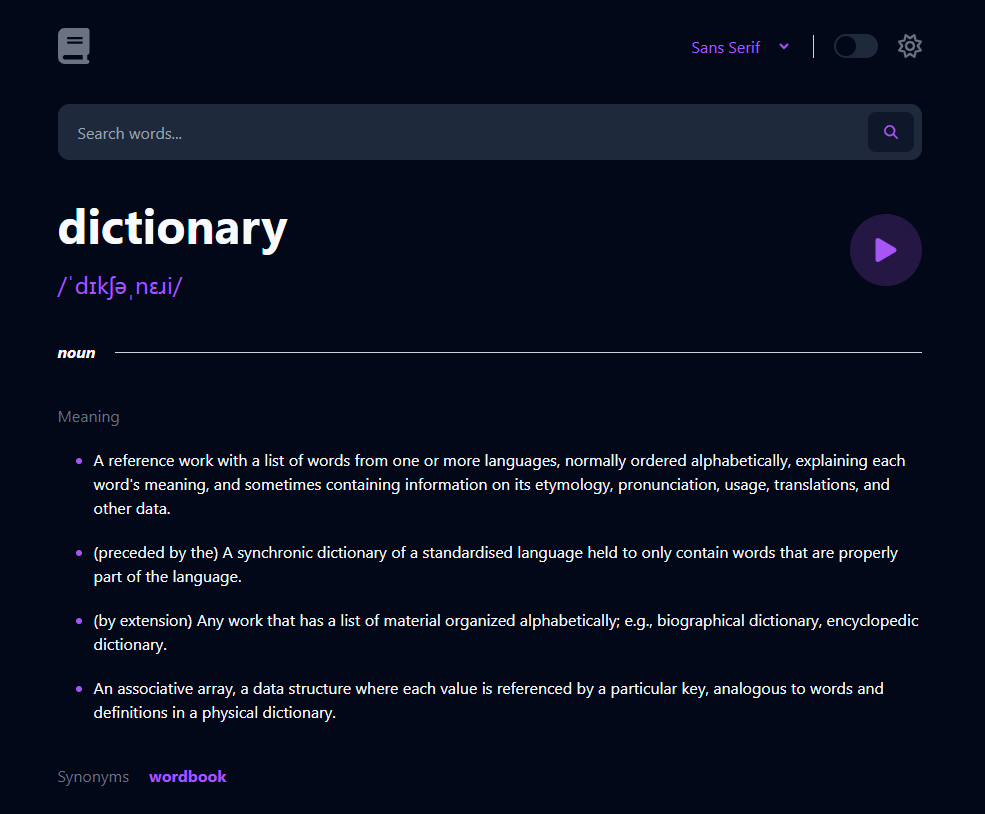

# Word Vault Dictionary App
This is a project that utilizes HTML, Tailwind CSS, and Next.js to create a mobile first responsive dictionary app. The application allows users to input words to find their definition and information through an external API. Options for switching between light mode and dark mode, as well as switching between different fonts are available, and all of the changes, whether it be the mode or font, will be saved to local storage.

**Preview of the dictionary application:**  

## View Site
Link: https://deepgit-word-vault.netlify.app/

## Technologies Utilized
- HTML
- Tailwind CSS
- Javascript / React / Next.js
- Vite
